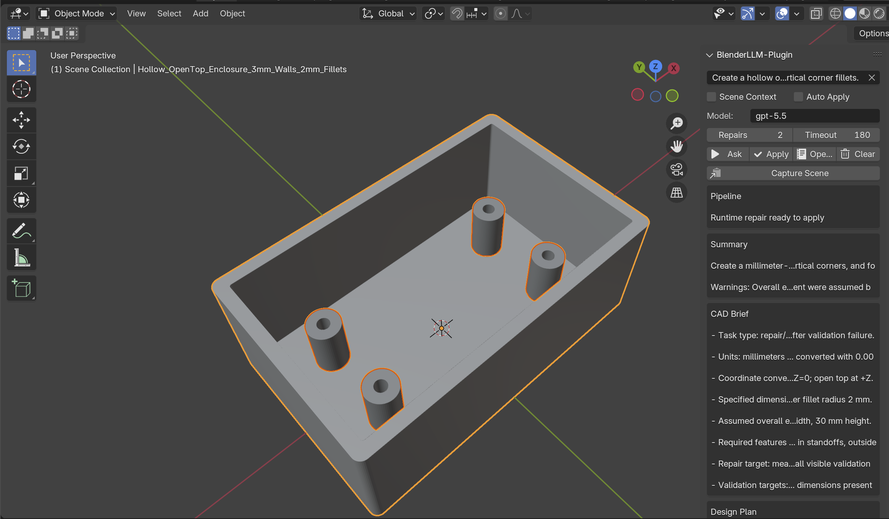
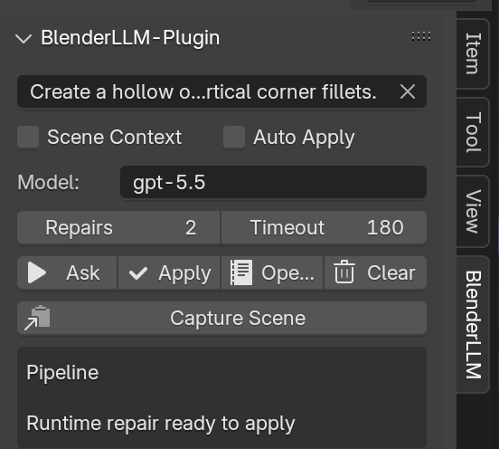
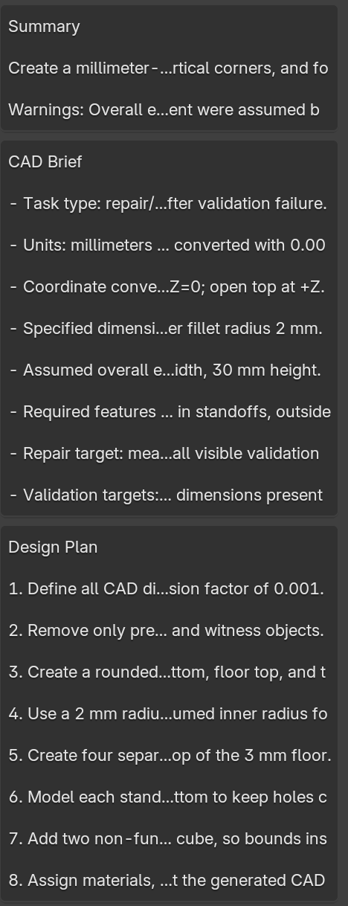
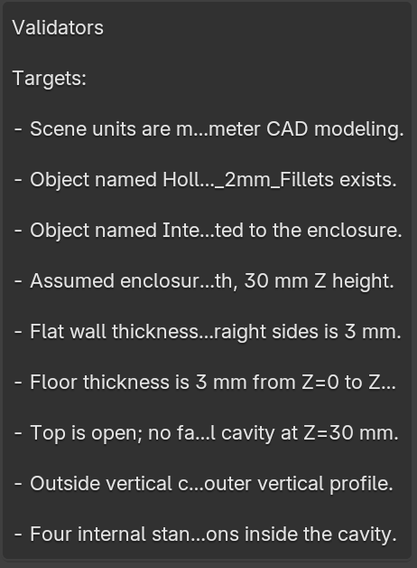

# BlenderLLM-Plugin

BlenderLLM-Plugin is an installable Blender add-on that turns natural language prompts into CAD-style Blender geometry. It works like a lightweight LLM/Codex panel inside Blender: describe the part, generate a CAD brief and design plan, review the generated Python, apply it to the scene, then inspect and repair the result when needed.

The project is inspired by text-to-CAD workflows: prompt -> CAD brief -> design plan -> generated code -> validation -> repair loop -> final scene.

## Preview

### Generated Open-Top Enclosure



### Sidebar Controls



### CAD Brief And Design Plan



### Validation Targets



## What It Does

- Generates Blender Python from a natural language CAD prompt.
- Builds a CAD brief with units, dimensions, features, assumptions, and validation targets.
- Runs static validators before Apply.
- Applies generated code inside Blender with Blender 4.2 API compatibility fixes.
- Inspects the scene after Apply by measuring visible mesh bounds.
- Captures a best-effort viewport snapshot.
- Sends runtime errors and measured scene facts back into a repair request when Apply fails.

## How It Works

```text
Prompt
  -> CAD brief
  -> LLM design plan
  -> Blender Python code
  -> Static geometry and constraint validation
  -> Repair loop if needed
  -> Apply in Blender
  -> Scene inspection and dimension checks
  -> Runtime repair if needed
  -> Final CAD scene
```

## Example Prompt

Use this prompt to generate the open-top electronics-style enclosure shown above:

```text
Create a hollow open-top enclosure with 3 mm walls and floor. Add four internal standoffs with centered blind holes and 2 mm outside vertical corner fillets.
```

For more consistent CAD output, use the expanded version below:

```text
Create a clean CAD-style hollow open-top rectangular enclosure in Blender.

Requirements:
- Units must be millimeters. Set Blender scene units to METRIC with scale_length 0.001.
- Outer enclosure size: 90 mm long, 55 mm wide, 30 mm tall.
- Wall thickness: 3 mm.
- Floor thickness: 3 mm.
- Top must remain open with no lid or top face covering the cavity.
- Add 2 mm outside vertical corner fillets on all four outer enclosure corners.
- Add four internal cylindrical standoffs on the floor, one near each corner inside the cavity.
- Each standoff should be 10 mm outer diameter and 18 mm tall from the floor.
- Each standoff must have a centered blind hole, 4 mm diameter and 12 mm deep. The hole should not pass through the floor.
- Keep standoffs fully inside the enclosure and clear of the walls.
- Name the main object Hollow_OpenTop_Enclosure_3mm_Walls_2mm_Fillets.
- Name or label the standoff features Internal_Standoffs_Blind_Holes.
- Use a neutral gray plastic material and slightly smooth shading.
- Add simple lighting and camera only if they do not interfere with the geometry.

Validation targets:
- Overall bounds are about 90 mm x 55 mm x 30 mm.
- Wall thickness is 3 mm.
- Floor thickness is 3 mm.
- Top is open.
- Four internal standoffs exist.
- Each standoff has a centered blind hole.
- Outside vertical corner fillets are 2 mm radius.
- Generated code must use Blender 4.2-compatible bpy APIs only.
```

For faster iteration, start with `Scene Context` off, `Repairs = 0` or `1`, keep `Auto Apply` off, and click `Apply` only after reviewing the generated code.

## Install

1. Create a local `.env` from the demo file:

   ```bash
   cp .env.example .env
   ```

2. Edit `.env` and set your real key:

   ```text
   OPENAI_API_KEY=sk-proj-your-real-key
   ```

   `.env` is ignored by git. The build script reads it and writes the key into the install zip as `blenderllm_plugin/local_settings.py`. This is the recommended option for long `sk-proj` keys because some Blender preference text fields may cut off around 127 characters.

3. Build the add-on zip:

   ```bash
   python scripts/build_blender_plugin.py
   ```

4. Open Blender.
5. Go to `Edit > Preferences > Add-ons`.
6. Click `Install...` and choose:

   ```text
   dist/blenderllm_plugin-1.0.0.zip
   ```

7. Enable `BlenderLLM-Plugin`.
8. In the add-on preferences, choose a `Key Source`:

   ```text
   Packaged .env key       Recommended for long keys. Uses the key bundled from .env at build time.
   Blender preference key  Optional fallback. May cut off around 127 characters on some Blender versions.
   ```

9. Go to `Edit > Preferences > System > Network` and enable `Allow Online Access`.
10. In the 3D View, press `N` and open the `BlenderLLM` tab.

## Recommended Workflow

1. Type a dimensioned prompt.
2. Disable `Scene Context` for brand-new parts, or enable it when modifying an existing scene.
3. Keep `Auto Apply` off while testing.
4. Set `Repairs` to `0` or `1` for faster responses.
5. Click `Ask`.
6. Review the CAD brief, design plan, validators, and generated Python.
7. Click `Apply`.
8. If Apply fails or the measured scene does not match the prompt, wait for runtime repair to generate replacement code, then click `Apply` again.

## Project Structure

```text
packages/                         Shared OpenAI, prompt, parsing, safety, and validation logic
plugins/                          Blender add-on UI, operators, runtime, scene inspection
scripts/build_blender_plugin.py    Blender zip builder
tests/                             Pure Python tests
docs/architecture.md               Architecture notes
docs/images/                       README screenshots
dist/                              Built plugin zips
```

The repo source is intentionally flat. The builder packages `plugins/` into the installable `blenderllm_plugin/` add-on folder and packages `packages/` into `blenderllm_plugin/core/blenderllm_plugin_core/` inside the zip.

## API Key Setup

BlenderLLM-Plugin supports two key sources in the add-on preferences:

```text
Packaged .env key       Uses OPENAI_API_KEY from the project .env file when the zip is built.
Blender preference key  Uses the key typed into Blender's add-on preferences.
```

Use `Packaged .env key` when possible. It avoids the preference-field truncation issue seen on some Blender builds and keeps the full key inside the installed add-on's generated `local_settings.py`.

Use `Blender preference key` only for quick tests or shorter keys. The preferences page shows a masked preview and character count so you can confirm whether Blender stored the full key.

## Troubleshooting

### OpenAI Requests Are Slow

Try these settings first:

```text
Scene Context: off
Auto Apply: off
Repairs: 0 or 1
Timeout: 60-120
```

Long prompts, scene context, and repair loops can turn one user action into multiple model requests.

### OpenAI Requests Fail in Blender

Enable `Edit > Preferences > System > Network > Allow Online Access`. Blender must be allowed to make network requests.

If the add-on says no OpenAI key is configured, add `OPENAI_API_KEY` to the project `.env`, rebuild `dist/blenderllm_plugin-1.0.0.zip`, then reinstall the add-on.

If you use `Blender preference key`, check the masked preview and character count in preferences. Long project keys are often around 160+ characters; if the count stops around 127, switch to `Packaged .env key`. If you know a reliable Blender preference workaround for long password fields, please share it in a GitHub issue or discussion so we can improve this path.

### Add-on Does Not Show Up

Restart Blender after installing. Then check `Edit > Preferences > Add-ons` and search for `BlenderLLM-Plugin`.

### Blender Crashes in Terminal Before Python Runs

If Blender opens normally from the app icon but crashes for terminal commands like `Blender -b --python-expr "print('ok')"`, the plugin is not running yet. That points to Blender startup, GPU/Metal, quarantine, or the installed Blender build.

Try these in order:

1. Quit Blender and reopen it from `/Applications`.
2. In `Edit > Preferences > System`, set `Cycles Render Devices` to `None`.
3. Clear macOS quarantine metadata for Blender if needed:

   ```bash
   xattr -dr com.apple.quarantine /Applications/Blender.app
   ```

4. Replace Blender 4.2.0 with a newer official Apple Silicon build.

## Test

```bash
python -m unittest discover -s tests
python -m py_compile packages/*.py plugins/*.py scripts/*.py
```

## Notes

Generated code runs inside Blender with access to `bpy`. Review generated Python before applying it, especially for prompts that modify or delete existing scene objects.
